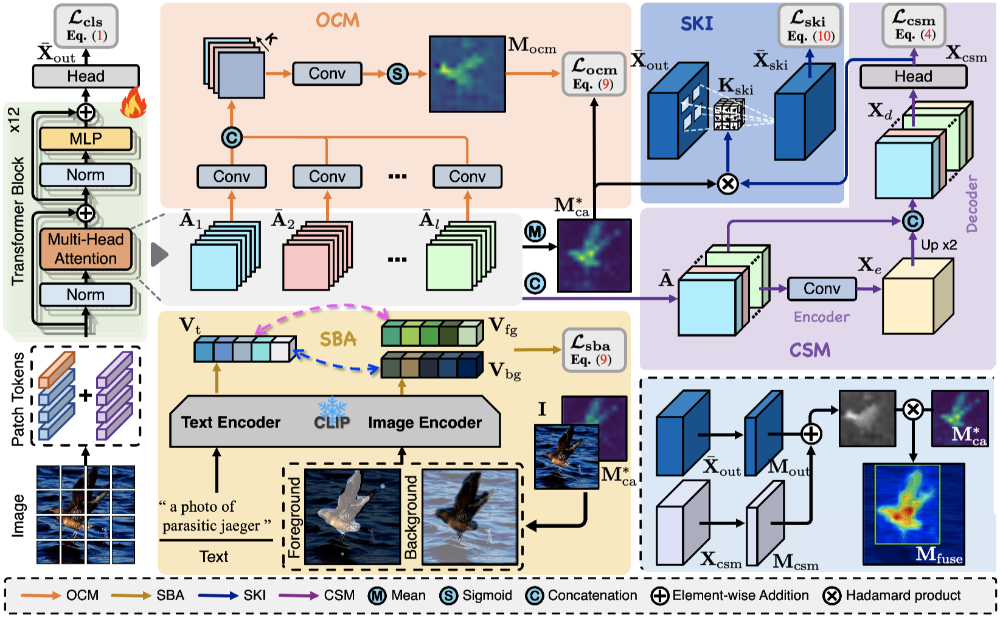

# Semantic-Driven Transformer for Weakly Supervised Object Localization

PyTorch implementation of ''Semantic-Driven Transformer for Weakly Supervised Object Localization''. 

''Semantic-Driven Transformer for Weakly Supervised Object Localization'' is built upon our conference version ([ICCV 2023](https://openaccess.thecvf.com/content/ICCV2023/papers/Chen_Category-aware_Allocation_Transformer_for_Weakly_Supervised_Object_Localization_ICCV_2023_paper.pdf))

## 📋 Table of content
 1. [📎 Paper Link](#1)
 2. [💡 Abstract](#2)
 3. [📖 Method](#3)
 4. [📃 Requirements](#4)
 5. [✏️ Usage](#5)
    1. [Start](#51)
    2. [Prepare Datasets](#52)
    2. [Model Zoo](#53)
    3. [Training](#54)
    4. [Inference](#55)
 6. [🔍 Citation](#6)
 7. [❤️ Acknowledgement](#7)

## 📎 Paper Link <a name="1"></a> 

* Category-aware Allocation Transformer for Weakly Supervised Object Localization ([link](https://openaccess.thecvf.com/content/ICCV2023/papers/Chen_Category-aware_Allocation_Transformer_for_Weakly_Supervised_Object_Localization_ICCV_2023_paper.pdf))

    Authors: Zhiwei Chen, Jinren Ding, Liujuan Cao, Yunhang Shen, Shengchuan Zhang, Guannan Jiang, Rongrong Ji
    
    Institution: Xiamen University, Xiamen, China. Tencent Youtu Lab, Shanghai, China. CATL, China.
    
* Semantic-Driven Transformer for Weakly Supervised Object Localization ([link]())

    Authors: Zhiwei Chen, Yunhang Shen, Liujuan Cao, Shengchuan Zhang, Rongrong Ji
    
    Institution: Xiamen University, Xiamen, China. Tencent Youtu Lab, Shanghai, China.


## 💡 Abstract <a name="2"></a> 
Weakly supervised object localization (WSOL) aims to localize objects based on only image-level labels as supervision. Although recent advancements incorporating transformers into WSOL have resulted in improvements, these methods frequently depend on category-agnostic attention maps, culminating in suboptimal object localization. This paper presents a novel Semantic-Driven TRansformer (SDTR), which learns category-aware representations for specific objects and generates corresponding category-aware attention maps for object localization. First, we introduce a Category-aware Stimulation Module (CSM) to induce learnable category biases in self-attention maps, providing auxiliary supervision to guide the learning of more effective transformer representations. Second, an Object Constraint Module (OCM) is proposed to refine the object regions for the category-aware attention maps in a self-supervised manner. Additionally, a Semantic Kernel Integrator (SKI) is introduced to generate a semantic kernel for self-attention maps, establishing a connection between CSM and OCM. Furthermore, a Semantic Boost Adapter (SBA) is designed, incorporating a Contrastive Language-Image Pre-training (CLIP) model for refined semantic guidance. Extensive experimental evaluations on benchmark datasets such as CUB-200-2011 and ILSVRC highlight the superior performance of our SDTR framework. The code and models for this study are accessible at https://github.com/zhiweichen0012/SDTR.

## 📖 Method <a name="3"></a> 

<p align="center">
     <br />
    <em> 
    </em>
</p>
The architecture of the proposed Semantic-Driven TRansformer (SDTR).

## 📃 Requirements <a name="4"></a> 
  - PyTorch==1.10.1  
  - torchvision==0.11.2
  - timm==0.4.12

## ✏️ Usage <a name="5"></a> 

### Start <a name="51"></a> 

```bash  
git clone git@github.com:zhiweichen0012/SDTR.git
cd SDTR
```

### Prepare Datasets <a name="52"></a> 

* CUB ([http://www.vision.caltech.edu/datasets/cub_200_2011/](http://www.vision.caltech.edu/datasets/cub_200_2011/))
* ILSVRC ([https://www.image-net.org/challenges/LSVRC/](https://www.image-net.org/challenges/LSVRC/))

The directory structure is the standard layout for the torchvision [`datasets.ImageFolder`](https://pytorch.org/docs/stable/torchvision/datasets.html#imagefolder), and the training and validation data is expected to be in the `train/` folder and `val` folder respectively:

```
/path/to/imagenet/
  train/
    class1/
      img1.jpeg
    class2/
      img2.jpeg
  val/
    class1/
      img3.jpeg
    class/2
      img4.jpeg
```

### Model Zoo <a name="53"></a> 
We provide the trained SDTR models.
| Name | Loc. Acc@1 | Loc. Acc@5 | URL |
| --- | --- | --- | --- |
| SDTR_CUB | 81.33     | 94.06     | [model](https://drive.google.com/drive/folders/144yLFl9gJxPp1uC4RThQIqCy3GIz5OsB?usp=sharing) |
| SDTR_ILSVRC | 58.20 | 68.05 | [model](https://drive.google.com/drive/folders/144yLFl9gJxPp1uC4RThQIqCy3GIz5OsB?usp=sharing) |

### Training <a name="54"></a> 

To train SDTR on CUB with 4 GPUs run:

```bash
bash scripts/train.sh deit_small_patch16_224_SDTR_cub CUB 110 /path/to/output_ckpt/CUB
```

To train SDTR on ILSVRC with 4 GPUs run:

```bash
bash scripts/train.sh deit_small_patch16_224_SDTR_imnet IMNET 14 /path/to/output_ckpt/IMNET
```

NOTE: Please check the paths to the "torchrun" command, the dataset, and the pre-training weights in the ``` scripts/train.sh ```.

### Inference <a name="55"></a> 

To test the CUB models, you can run:

```bash  
bash scripts/test.sh deit_small_patch16_224_SDTR_cub CUB /path/to/SDTR_CUB_model
```

To test the ILSVRC models, you can run:

```bash  
bash scripts/test.sh deit_small_patch16_224_SDTR_imnet IMNET /path/to/SDTR_IMNET_model
```

NOTE: Please check the paths to the "python3" command and the dataset in the ``` scripts/test.sh ```.

## 🔍 Citation <a name="6"></a> 

```
@inproceedings{chen2023category,
  title={Category-aware Allocation Transformer for Weakly Supervised Object Localization},
  author={Chen, Zhiwei and Ding, Jinren and Cao, Liujuan and Shen, Yunhang and Zhang, Shengchuan and Jiang, Guannan and Ji, Rongrong},
  booktitle={Proceedings of the IEEE/CVF International Conference on Computer Vision},
  pages={6643--6652},
  year={2023}
}
```

## ❤️ Acknowledgement <a name="7"></a> 

We use [deit](https://github.com/facebookresearch/deit) and their [pre-trained weights](https://dl.fbaipublicfiles.com/deit/deit_small_patch16_224-cd65a155.pth) as the backbone. Many thanks to their brilliant works!
